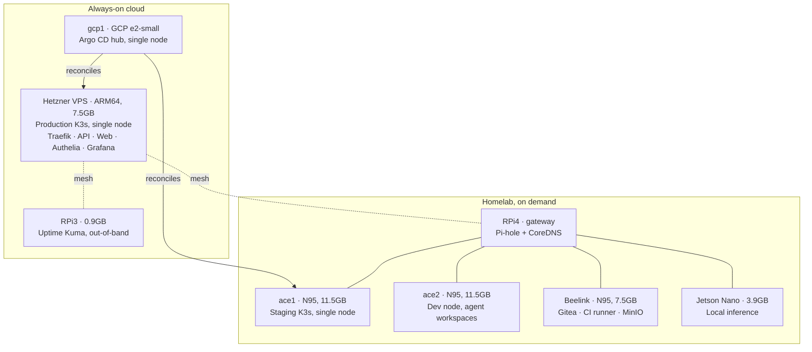

This note sat in the repository for five months with a single line in it: *"This is a placeholder article. Real content will replace this once the vault-to-notes pipeline is operational."* The pipeline was never the problem. Writing about a platform while you are still changing your mind about it is the problem.

The platform stopped changing its mind a while ago. So here is what is actually running, measured against what I said I would build.

## What I said I would build

In [December 2024](/notes/why-build-homelab/) I wrote down the plan:

> **Compute**: K3s across multiple nodes, with proper control plane separation

That is the sentence I got most wrong.

## What runs

Eight machines are powered on today. **Three of them run Kubernetes.** The other five run Docker or systemd, and that is not a migration in progress — it is the design.

Three Kubernetes clusters, each a single node: production on the VPS, staging on ace1, and the Argo CD hub on a small GCP instance. They do not federate. They do not share a control plane. Each one is a complete K3s install that happens to be one machine wide.

That is the opposite of "multiple nodes with proper control plane separation", and it took me a long time to stop treating it as a compromise.

## Why most of the fleet has no Kubernetes on it

The five non-Kubernetes machines each do one job that Kubernetes would have made worse:

**The RPi4 is the DNS gateway.** Pi-hole and CoreDNS, split-horizon. It has to answer when the cluster is down, because "the cluster is down" is frequently a DNS question. Putting the resolver inside the thing it resolves is a loop I have already debugged once, [at length](/notes/pihole-broke-vpn/).

**The RPi3 runs Uptime Kuma and nothing else.** A monitor that shares infrastructure with the thing it monitors is a monitor that goes quiet exactly when you need it. It has 0.9 GB of RAM and its entire value is being somewhere else.

**The Beelink is the forge.** Gitea, the CI runner, MinIO, and the Buildx builders. The machine that builds the images should not depend on the platform that runs them; otherwise a bad deploy costs you the ability to fix it.

**The Jetson runs inference directly on systemd.** Ollama with a small local model. Its 128 CUDA cores are sitting unused — the model runs on CPU, and I have not measured the latency, so I am not going to publish a number for it.

**ace2 is where I work.** Coding agents get one workspace each. It is a workstation I never sit in front of.

Kubernetes is very good at "many identical things that should be interchangeable". None of the five are that. They are five singular machines whose failure modes should stay independent.

## What the plan got right

The layers I said I wanted are all there, and they are the parts I would keep:

- **The mesh.** Every node joins an encrypted WireGuard mesh through Headscale. There are zero port-forwarding rules on my home network. Machines in Germany and machines in the USA talk to each other as if they shared a switch.
- **Reconciliation instead of deployment.** Argo CD watches a Git repository and makes the clusters match it, in under thirty seconds. I have not run `kubectl apply` against production in a long time, which is a change my older notes have not caught up with yet.
- **SSO on everything internal.** Authelia in front of every internal tool.
- **TLS everywhere**, automatically, including on machines that never accept an inbound connection.

## What the plan got wrong, besides the cluster shape

The [May 2025 topology note](/notes/network-topology-hybrid/) describes Proxmox hosts running K3s inside VMs. **There is no hypervisor anywhere in the platform now.** The nodes run Ubuntu and their workload directly on the metal. That note is accurate for the date on it and wrong for today, and I would rather say so here than quietly rewrite it.

The same goes for the hardware in those older notes. Numbers drift; a note is a photograph, not a mirror.

## The part that is still a promise

`aws1` is a cold standby for the Argo CD hub. The playbook that reprovisions it is in the repository, it worked when the hub actually lived there, and the machine is powered down.

**I have never rehearsed the restore.** A standby you have not exercised is an aspiration with a `.yml` next to it, and I would rather write that sentence than imply a disaster recovery story I cannot demonstrate. Automating that rehearsal — provision, verify it joins the mesh, destroy — is the next infrastructure job on the list.

## The number I will stand behind

Uptime is 99.9% over the last ninety days, measured by Uptime Kuma from the RPi3, which is the only node with no stake in the answer. Thirty-five services are deployed as of this writing; the figure comes from the platform manifest that builds this site, so it is a snapshot, not a constant.

Everything else you might want to know — which machine, which architecture, how much RAM, what it is actually doing right now — is on [the Lab page](/lab/), generated from the same source as this diagram rather than typed twice.

## What eighteen months actually taught me

Not Kubernetes internals, in the end. I learned those, but they were not the expensive lesson.

The expensive lesson was that **the interesting decisions are about what does *not* go on the platform.** Anything that has to keep working while the platform is broken belongs outside it: the resolver, the monitor, the forge. Getting that wrong is how a homelab becomes a system where every failure is a total failure, and it is the same instinct that makes a production platform survivable.

The plan called it an internal developer platform. What I built is closer to a small hosting company with one customer, and the one customer keeps filing bugs against himself.
