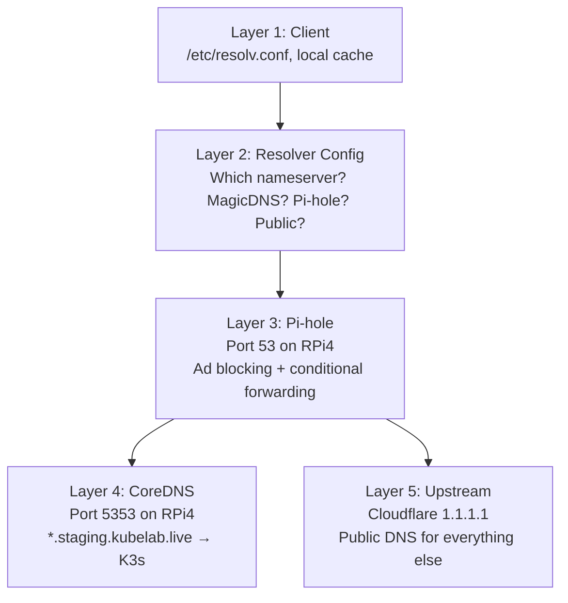

"It's always DNS" is a meme for a reason. But "it's DNS" tells you nothing about WHERE in the chain it broke. It's like saying "it's always the car" when your engine won't start. Sure. Which part of the car.

After the fifth DNS outage in my homelab -- each one caused by a different layer of the stack -- I stopped guessing and built a systematic approach. Five layers, top-down, same order every time. The first layer that works tells you the broken one is directly below it.

## The 5-layer model

My homelab DNS chain has five distinct layers between a client typing `grafana.staging.kubelab.live` and getting a response. Every DNS problem I've had lives in exactly one of them.



I always start at Layer 1 and work down. The temptation is to jump straight to the layer you suspect, but that wastes time more often than it saves. Two minutes of methodical checking beats twenty minutes of assumptions.

## Layer 1: The client

Before you touch a single server, check the machine that's having the problem.

```bash
# Flush the local DNS cache
resolvectl flush-caches

# Check what resolv.conf actually says
cat /etc/resolv.conf

# Is Headscale pushing split DNS that overrides your config?
tailscale dns status

# Basic resolution test
dig grafana.staging.kubelab.live
```

The number of times I've debugged a server-side issue that turned out to be a stale local cache is embarrassing. `resolvectl flush-caches` (or `systemd-resolve --flush-caches` on older systems) is always step one.

The `tailscale dns status` check matters because Headscale can push split DNS rules that silently override your resolver config. If split DNS is active for `kubelab.live`, your client might be sending queries to `100.100.100.100` (Tailscale's MagicDNS) instead of your Pi-hole. This has bitten me twice. The fix is `tailscale down && tailscale up` to force a re-sync of DNS configuration from the control server.

## Layer 2: Resolver configuration

Now you know what nameserver the client is using. Test that nameserver directly.

```bash
# Query the specific nameserver your client is configured to use
dig @172.16.1.1 grafana.staging.kubelab.live

# If you're on a Tailscale node, also test the MagicDNS resolver
dig @100.100.100.100 grafana.staging.kubelab.live

# Compare with a known-good public resolver
dig @1.1.1.1 kubelab.live
```

If `dig @172.16.1.1` fails but `dig @1.1.1.1` works, the problem is between you and Pi-hole. If both fail, check your network connectivity before going further.

One gotcha here: if the client is on a machine running Tailscale with `--accept-dns=true` (the default), Tailscale may have rewritten `/etc/resolv.conf` to use `100.100.100.100`. Your client thinks it's using Pi-hole but it's actually using MagicDNS. Always verify with `cat /etc/resolv.conf`, not with what you remember configuring.

## Layer 3: Pi-hole

Pi-hole runs on the RPi4 at 172.16.1.1, port 53. It handles ad blocking and forwards `*.kubelab.live` queries to CoreDNS.

```bash
# Is Pi-hole actually running?
ssh rpi4 "docker ps --format '{{.Names}} {{.Status}}' | grep pihole"

# Can Pi-hole resolve normal domains?
dig @172.16.1.1 google.com

# Can Pi-hole forward to CoreDNS?
dig @172.16.1.1 grafana.staging.kubelab.live

# Check Pi-hole's conditional forwarding config
ssh rpi4 "docker exec pihole cat /etc/pihole/pihole.toml | grep -A5 'etc_dnsmasq_d'"
```

The Pi-hole v6 gotchas I've collected the hard way:

- **`etc_dnsmasq_d` defaults to `false`**. If you dropped a forwarding config in `/etc/dnsmasq.d/`, Pi-hole v6 is ignoring it unless you explicitly set this to `true` in `pihole.toml`.
- **`pihole reloaddns` does not reload forwarding rules.** It reloads blocklists. Only `docker restart pihole` picks up dnsmasq config changes. The command exits successfully and lies to you.
- **`listeningMode = "LOCAL"` rejects LAN queries.** If your K3s nodes are on a different subnet or Docker network, Pi-hole considers them non-local and drops their queries silently. Set it to `"ALL"` or configure the correct interfaces.

If `dig @172.16.1.1 google.com` works but `dig @172.16.1.1 grafana.staging.kubelab.live` doesn't, the forwarding from Pi-hole to CoreDNS is broken. Move to Layer 4.

## Layer 4: CoreDNS

CoreDNS runs on the RPi4 at port 5353. It handles the `*.staging.kubelab.live` zone and returns the K3s Traefik IP (100.64.0.4).

```bash
# Query CoreDNS directly, bypassing Pi-hole
dig @172.16.1.1 -p 5353 grafana.staging.kubelab.live

# Check CoreDNS logs for errors
ssh rpi4 "docker logs coredns --tail 50 2>&1 | grep -i -E 'error|fail|refused'"

# Verify CoreDNS is actually listening
ssh rpi4 "ss -ulnp | grep 5353"
```

CoreDNS has its own set of traps:

- **Avahi squats on port 5353.** Ubuntu ships with `avahi-daemon` which uses port 5353 for mDNS. You must disable both the service AND the socket unit. `systemctl disable avahi-daemon` alone is not enough -- systemd socket activation will restart it.
- **Never mix `hosts` and `template` plugins in the same zone when IPs differ.** If you have a `hosts` entry pointing `foo.kubelab.live` to one IP and a `template` generating a wildcard pointing to a different IP, `template` wins. The `hosts` entry becomes invisible. I lost an hour to this because the Corefile looked correct and the behavior was wrong.
- **Check the Corefile indentation.** CoreDNS uses Caddyfile syntax. A plugin indented under the wrong server block silently applies to the wrong zone. No error, no warning, just wrong answers.

## Layer 5: Upstream

If everything above works for internal domains but external resolution fails:

```bash
# Test public DNS directly
dig @1.1.1.1 kubelab.live
dig @8.8.8.8 kubelab.live

# Check if Cloudflare has the expected records
dig @1.1.1.1 staging.kubelab.live A
dig @1.1.1.1 kubelab.live MX
```

If `dig @1.1.1.1` fails, it's not your infrastructure. It's either a Cloudflare outage (rare) or your DNS records are misconfigured at the registrar level. Check the Cloudflare dashboard.

## The full diagnostic in 60 seconds

When something breaks, I run this exact sequence. It takes about a minute and isolates the layer every time.

```bash
# Layer 1: Client
resolvectl flush-caches
cat /etc/resolv.conf

# Layer 2: Resolver
dig @172.16.1.1 grafana.staging.kubelab.live +short

# Layer 3: Pi-hole
dig @172.16.1.1 google.com +short

# Layer 4: CoreDNS
dig @172.16.1.1 -p 5353 grafana.staging.kubelab.live +short

# Layer 5: Upstream
dig @1.1.1.1 kubelab.live +short
```

Five commands. If Layer 3 returns an answer for `google.com` but not for the staging domain, the problem is the Pi-hole-to-CoreDNS forwarding. If Layer 4 returns nothing, CoreDNS is misconfigured or down. The first layer that fails points you at the exact component to investigate.

I don't do this because I'm disciplined. I do this because I wasted too many evenings chasing the wrong layer. The fifth DNS outage taught me what the first four should have: stop thinking and start measuring, from the top, every time.
