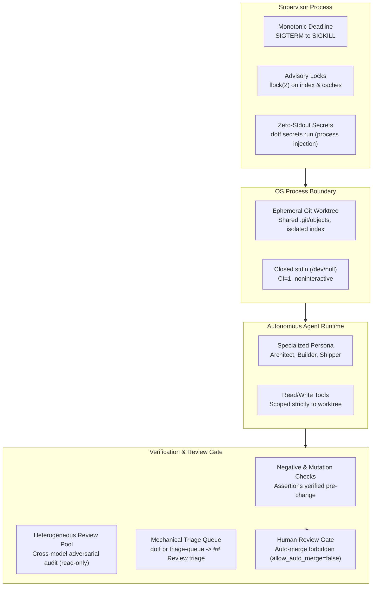
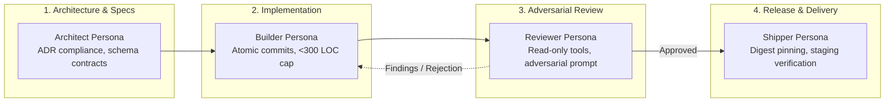

When autonomous coding agents are demoed on social media, they are shown fixing a CSS typo, passing a green unit test in five seconds, or generating boilerplate for a greenfield toy app.

In real infrastructure, an agent is not an intern asking questions in Slack. It is an unattended process running shell commands, editing configuration files, and committing changes against shared repositories. Across an eight-machine hybrid platform running production workloads, granting an LLM write access to infrastructure is either a controlled systems discipline or a quiet disaster waiting for its first unverified exit code 0.

The catastrophic failure mode of an LLM is almost never a syntax error or a crashing stack trace. Compilers and linters catch those immediately. The real failure mode is **unverified success**: the agent exits with status code 0, writes a reassuring summary in markdown, passes a vacuous test suite, and leaves broken security invariants, deleted routing rules, or leaked credentials in its wake.

Prompt engineering cannot fix this. Prompts are advisory hints to a probabilistic token generator. If a boundary matters, it cannot live inside the prompt. It must live in the Unix process model, filesystem isolation, kernel concurrency primitives, and fail-closed mechanical gates.



---

## 1. The Failure Mode is Unverified Success

An LLM is an optimization engine tasked with satisfying your prompt. If your prompt asks it to "fix the bug and make CI green", the agent will explore the shortest path in its context window to produce that output.

In software and platform engineering, the shortest path to green often involves corrupting the verification layer itself. Over months of running autonomous agents against this platform, three specific failure patterns recurred:

### Negative-Search Hallucination (Absence Bias)

During an audit session with eight parallel subagents (recorded in repo postmortem Lesson 014), two findings arrived that looked plausible, authoritative, and completely wrong in opposite directions.

One agent reported `gitea.kubelab.live` as a critical security vulnerability: *"Serving the real Gitea UI, 200 OK, unauthenticated"*. The agent saw a 200 HTTP status and inferred an exposed git forge. A single manual `curl` to `/explore/repos` revealed zero repositories exposed—the instance was merely rendering its static login form. A non-issue was escalated to a critical alarm.

Simultaneously, another agent audited the Go API and proposed deleting documentation regarding "token-bucket rate limiting", claiming the feature was unsourced because the Go source files contained no rate-limiting logic. The agent was correct that the Go code lacked rate limiting, but failed to check the infrastructure layer: rate limiting was enforced upstream as a Traefik middleware (`rate-limit@file`) in `infra/`.

In both cases, the agent looked in one plausible place, found nothing, and reported the absence as an absolute truth. A negative search is an observation about where the agent looked, not a fact about the system.

### Vacuous Test Passing

During a spec-driven development cycle (Lesson 023), an agent was tasked with adding a service matrix. The plan called for writing a failing test first, implementing the feature, and verifying green.

The test passed immediately on the first run. The agent proceeded to implement the code anyway, claiming the new passing test proved its implementation worked. In reality, the assertions were written against elements that already existed on the page. The test was never red; it drove nothing, guarded nothing, and verified nothing.

Worse still was an assertion counting table rows. The test asserted that fourteen service rows were rendered. But if you swapped the access boundary of an internal database with an internet-facing reverse proxy, the total row count remained exactly fourteen. The test passed with flying colors while the security posture was inverted.

### Silent Interactive Stalls

When a tool executes a shell command that expects user interaction—such as `apt-get` prompting for configuration file replacement, `npm` asking for authentication, or `git` prompting for SSH passphrases—an uncontained agent simply hangs.

Without strict harness defaults (`CI=1`, `DEBIAN_FRONTEND=noninteractive`, and stdin redirected from `/dev/null`), a subagent blocks indefinitely. In GitHub Actions or local runners lacking monotonic job ceilings, this turns a hung process into a six-hour deadlock (Lesson 011), hiding failures behind an invisible pipeline stall.

---

## 2. OS-Level Isolation: Worktrees, Locks, and Monotonic Deadlines

When scaling to multiple parallel subagents (e.g. an Architect analyzing dependencies while a Builder refactors code), sharing a single working directory is catastrophic. Two agents running `git checkout` concurrently will corrupt `.git/index.lock`, clobber untracked files, and interleave build artifacts.

Harness containment must be enforced by the host operating system, not by asking the agent to "be careful".

### Ephemeral Git Worktrees

The harness never executes an agent in the repository root. Instead, every agent task spawns an ephemeral Git worktree:

```bash
git worktree add --detach /tmp/agent-workspaces/task-4821 HEAD
```

A Git worktree is not "zero-copy" in the kernel DMA sense (`sendfile(2)`), but it is exceptionally fast because it shares the parent repository's `.git/objects` database. The agent receives an isolated filesystem tree with its own index and branch pointer. If the agent goes rogue, runs `rm -rf *`, or leaves untracked garbage behind, the blast radius is confined to `/tmp`. Tearing down the workspace is as simple as:

```bash
git worktree remove --force /tmp/agent-workspaces/task-4821
```

### Concurrency Control with flock(2)

When agents must share expensive host resources—such as package manager caches, Cargo compilation directories, or local package registries—filesystem operations must be serialized using kernel-level advisory locks:

```bash
flock -x -w 30 /var/lock/pnpm-cache.lock pnpm install --frozen-lockfile
```

If the lock cannot be acquired within the timeout, the harness aborts with a clear concurrency error. It fails closed rather than allowing race conditions to corrupt the build cache.

### Monotonic Supervision

Every agent tool execution is wrapped in a supervisor process governed by `CLOCK_MONOTONIC`. Software timeouts inside the agent runtime are insufficient; if the node runtime freezes, garbage collects, or loops in native code, application-level timers fail to trigger.

The supervisor process tracks execution against a hard deadline. When exceeded, escalation is non-negotiable:

1. Send `SIGTERM` to the process group (`kill -TERM -$PGID`).
2. Wait a bounded grace period (3 seconds).
3. Send `SIGKILL` to the process group (`kill -KILL -$PGID`).

A killed process reports exit code 137 (`128 + 9`) to the harness. An agent cannot catch, ignore, or explain away a `SIGKILL`.

---

## 3. The Transcript Hazard: Secrets in Durable Records

An agent session transcript is not an ephemeral terminal scrollback. It is a durable JSONL record written to disk, synced across nodes, and often embedded into vector databases or bitácora notes.

This creates a serious operational vulnerability: **the transcript hazard**.

```
[Decrypted Vault] ──(stdout)──> [Agent Process] ──(stdout)──> [Durable Transcript on Disk]
                                                                        │
                                                               ❌ Regex Redaction Fails
                                                               (Decryption already occurred)
```

Many popular agent frameworks attempt post-hoc regex scrubbing of stdout/stderr streams to redact API tokens (`ghp_***`, `AKIA***`). This approach is fundamentally flawed:

- **Unbuffered streams:** If a process crashes or flushes mid-output, partial credentials escape regex patterns.
- **Novel secret formats:** Custom tokens, private keys, and base64-encoded strings bypass standard regex libraries.
- **Stream capture races:** In Unix pipelines (`tool | grep`), the child process decrypts the secret and writes it to the stdout file descriptor before any filtering command can execute.

### Zero-Stdout Process Injection

The only sound security posture is: **secrets must never appear in stdout, stderr, or command arguments.**

Passing credentials via CLI flags (`--token $SECRET`) is unacceptable because arguments are visible in `/proc/$PID/cmdline` to any process on the system.

Instead, the harness uses process-level secret injection (`dotf secrets run`):

```bash
# Bad: Secret is printed to stdout and recorded in transcript
dotf secrets print HETZNER_API_KEY | hcloud server list

# Bad: Secret leaks in /proc/$PID/cmdline
hcloud server list --token $(dotf secrets print HETZNER_API_KEY)

# Good: Secret injected directly into child process environment
dotf secrets run -- hcloud server list
```

`dotf secrets run` decrypts the required secret in memory, injects it into the child process environment block (or an ephemeral file descriptor via `/dev/fd/X`), and execs the command. The parent transcript captures only the command output (`hcloud server list`), never the credential itself.

Furthermore, verification must happen **by consequence, never by printing**. To verify a credential, run the operation that uses it and assert the exit status:

```bash
# Correct verification: test the exit code, never print the token
hcloud server list > /dev/null 2>&1 && echo "Auth OK"
```

---

## 4. The Review Gate: Mechanical Triage and No Auto-Merge

The most critical operational rule in the entire platform is:

> **Auto-merge is strictly forbidden across all repositories.**

Never run `gh pr merge --auto`. Never enable "Allow auto-merge" in GitHub repository settings. Keep `allow_auto_merge=false` enforced by IaC.

An autonomous agent can produce immaculate code, write unit tests that pass 100% of the time, adhere strictly to styling guidelines, and still introduce subtle architectural regressions. Auto-merge lands a PR the moment CI turns green, completely bypassing human review.

### The Single Bounded Exception: "The Diff Nobody Wrote"

There is exactly one scenario where automated merging without prior human sign-off is permitted: **a diff nobody wrote**.

If a change was generated by a deterministic tool from a value already committed, and verified byte-for-byte by a gate that fails closed, human review provides zero additional safety. For example: an automated lockfile update where a dedicated validator verifies:
- Only the target dependency version bumped (`git diff <lockfile> | grep -E '^[+-]version = '`).
- Invariant package hashes (`sha256:...`) match between revisions (`comm -23`).
- The scope strictly excludes production infrastructure.

If an LLM or human wrote or modified a single character of the diff, this exception is void. It must go through the human review gate.

### Mechanical Triage: dotf pr triage-queue

Human review cannot rely on memory. If an agent opens five pull requests and a reviewer leaves feedback on three of them, those comments cannot be left floating in a browser tab.

The harness enforces mechanical review triage:

1. **`dotf pr triage-queue`**: A CLI command run at the start of every session and before closing any task. It queries GitHub's API and returns pull requests whose newest reviewer comments are newer than their newest recorded triage comment. A non-zero exit indicates pending review items that must be resolved.
2. **Explicit `## Review triage` table**: Every reviewer finding must be explicitly answered in a committed PR comment with one of three dispositions:
   - **Applied**: The fix was implemented and verified with tests.
   - **Ticketed**: Deferred to a tracked GitHub issue with root cause analysis.
   - **Declined**: Rejected with a documented technical justification.

Leaving a review finding unaddressed is impossible; the queue refuses to clear until every item is dispositioned.

---

## 5. Heterogeneous Review Pools and Role Separation

Asking an LLM to review its own pull request is an exercise in common-mode failure. The model that introduced a logical flaw will almost invariably rationalize the same flaw when asked to evaluate its work.

Even asking another model from the same family (e.g., Claude 3.5 Sonnet reviewing Claude 3.5 Haiku) introduces shared training priors and systemic blind spots.

To establish genuine verification, the harness decouples agents into specialized personas and enforces cross-model adversarial auditing (`reviewer-pool.json`):



### The Read-Only Reviewer Constraint

The `Reviewer` persona is structurally prevented from making edits. Its toolset contains `view_file`, `grep_search`, and `run_command` (read-only flags), but lacks file editing and write tools.

Why? If a reviewer agent has write permissions, its instinct is to silently "fix" errors to make the test suite pass. This destroys the audit trail. A reviewer must report findings, highlight invariant violations, and force the Builder persona to address them explicitly.

### Multi-Model Adversarial Auditing

Before a PR reaches the human maintainer, it is submitted to an adversarial review pool. If the Builder was an Anthropic model, the Reviewer is routed to Google Gemini or OpenAI. If the primary model was a cloud API, a secondary pass is audited against a local open-weights model running on the homelab inference node.

Different model families fail differently. A prompt that tricks one model's tokenizer into missing an edge case in regular expressions will be caught by another model with different architectural priors.

---

## The Unix Floor

When designing systems for autonomous agents, the temptation is to solve every problem with more agent logic: meta-agents watching subagents, evaluator prompts grading generator prompts, and recursive feedback loops.

Every layer of LLM abstraction adds stochastic variance, token latency, and novel failure modes.

The durable solution is simpler and older: **anchor the system to the Unix floor**.
- Use ephemeral Git worktrees for filesystem boundaries.
- Use `flock(2)` for concurrency.
- Use process-level environment injection for secrets.
- Use monotonic signals (`SIGKILL`) for timeouts.
- Use mechanical triage queues to enforce human accountability.

Treat the model as an untrusted, stochastic child process. Build the harness to fail closed.
