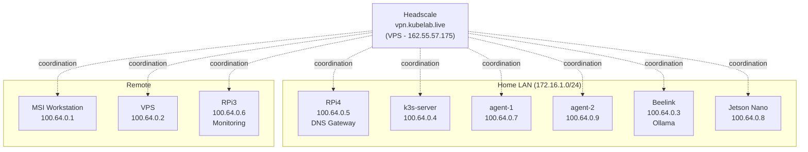

I have nine machines spread across two rooms, a closet, and a data center in Germany. They all need to talk to each other securely. The obvious answer is Tailscale. The less obvious answer is running your own Tailscale control plane.

That's what Headscale is. An open-source, self-hosted implementation of the Tailscale coordination server. No SaaS dependency, no usage limits, no "please upgrade to Enterprise for ACL policies." Just a single Go binary that manages WireGuard key exchange and node registration.

I've been running it for months. Here's why, and everything that went wrong along the way.

## Why not just use Tailscale's cloud

Tailscale works. The free tier is generous. For most people, the hosted control plane is the right choice.

But my homelab isn't "most people." It's infrastructure I'm building specifically to understand every layer. Outsourcing the coordination server to Tailscale defeats the purpose. I want to know how WireGuard key exchange works. I want to control the ACL policies in Git. I want to eliminate a third-party dependency from the critical path of my entire network.

There's also a practical reason: Tailscale's cloud has had outages. They're rare, but when the coordination server is down, new nodes can't join and existing nodes can't update their peer lists. If I'm debugging a K3s issue at midnight and Tailscale is having a bad day, that's two problems instead of one. With Headscale, the control plane runs on the same VPS that hosts everything else. If the VPS is down, I have bigger problems anyway.

And honestly, running your own VPN coordination server is a professional skills signal that "I use Tailscale" isn't. Anyone can install an app. Fewer people can operate the infrastructure behind it.

## Why not raw WireGuard

I considered it. WireGuard itself is elegant -- a kernel module with a minimal attack surface. But raw WireGuard is a pain to operate at scale:

- **Key exchange is manual.** Every node needs every other node's public key. With 9 nodes, that's 72 key pairs to manage. Add a node, update 8 configs.
- **No NAT traversal.** WireGuard doesn't punch through NATs on its own. My Jetson Nano sits behind a home router. My VPS has a public IP. Making them talk requires manual endpoint configuration or a separate STUN/TURN setup.
- **No DERP relays.** When direct connections fail (symmetric NATs, carrier-grade NAT), Tailscale falls back to DERP relay servers. Raw WireGuard just fails.
- **Routing tables are manual.** Every time the network topology changes, you're editing config files on every node.

Headscale gives me all of Tailscale's coordination features -- automatic key exchange, NAT traversal, DERP relays, Magic DNS -- without the manual overhead of raw WireGuard.

## The architecture

Headscale runs in Docker Compose on my Hetzner VPS (CX22, 5 EUR/month). The same VPS that hosts production. The Tailscale client runs on every other machine.



Nine nodes on the 100.64.0.0/24 range. The Headscale server itself sits outside the mesh -- it coordinates, but traffic flows directly between nodes over WireGuard tunnels. The VPS gets a Tailscale address too (100.64.0.2) so services running there are reachable over the mesh.

## TCP passthrough and the Noise protocol

Here's something that bit me early. Headscale uses Tailscale's Noise protocol for client-server communication. This is not HTTPS. Traefik, which reverse-proxies everything on my VPS, can't terminate Noise connections because they're not standard TLS.

The first time I pointed `vpn.kubelab.live` at Headscale through Traefik's normal HTTPS entrypoint, every `tailscale up` attempt failed with cryptic handshake errors. Traefik was trying to terminate TLS and forward plain HTTP to Headscale, but the Tailscale client expected an end-to-end Noise session.

The solution is TCP passthrough with SNI routing. Traefik reads the SNI header from the TLS ClientHello, matches `vpn.kubelab.live`, and forwards the raw TCP stream to Headscale without terminating it. Headscale handles its own TLS.

This also means `vpn.kubelab.live` must resolve to the VPS's public IP (162.55.57.175), never a Tailscale IP. The VPN control plane can't depend on the VPN being up. That's a bootstrap circular dependency that will lock you out of your entire mesh at the worst possible time.

## Headscale v0.28 CLI quirks

Headscale's CLI has changed significantly across versions. v0.28 uses numeric user IDs instead of usernames for most operations:

```bash
# Create a user
headscale users create kubelab

# List users to get the numeric ID
headscale users list
# ID | Name    | ...
# 2  | kubelab | ...

# Create a pre-auth key (uses numeric ID)
headscale preauthkeys create --user 2 --reusable --expiration 24h

# Approve routes advertised by a node
headscale nodes approve-routes --identifier 5 --route 172.16.1.0/24
```

The `--user` flag takes a number, not a name. The route approval is under `nodes`, not `routes`. If you're following a tutorial written for v0.22, half the commands won't work. I keep a cheat sheet because I still get the syntax wrong every other time.

## The Jetson Nano incident

My worst Headscale debugging session involved the Jetson Nano. After a routine reboot, the Jetson dropped off the mesh and wouldn't reconnect. `tailscale status` showed "logged out." Running `tailscale up --login-server=https://vpn.kubelab.live` hung indefinitely.

The root cause was systemd-resolved and MagicDNS creating a circular dependency. During boot, `tailscaled` started and configured `systemd-resolved` to use Headscale's MagicDNS. But MagicDNS needed to resolve `vpn.kubelab.live` to reach the Headscale server, and systemd-resolved was pointing at... MagicDNS. Deadlock.

The fix was two-fold. First, add a `FallbackDNS` entry in `/etc/systemd/resolved.conf`:

```ini
[Resolve]
FallbackDNS=1.1.1.1 8.8.8.8
```

This gives systemd-resolved a way out if the primary DNS (MagicDNS) is unreachable. Second, add a static `/etc/hosts` entry for the Headscale server so it never depends on DNS resolution at all:

```
162.55.57.175  vpn.kubelab.live
```

Belt and suspenders. The Jetson hasn't dropped off the mesh since.

## Where this is going

Right now I have one Headscale user (`kubelab`) with all nine nodes. The plan is three users: `kubelab` for infrastructure, `work` for work machines, and `contractors` for temporary access. ACL policies will live in Git, reviewed like any other infrastructure change. Contractor access gets pre-auth keys with short expiration -- join the mesh, do the work, key expires.

The coordination server is a single point of failure, and I'm aware of it. If the VPS goes down, existing WireGuard tunnels keep working (they're peer-to-peer), but no new nodes can join and peer lists can't update. For a homelab, that's acceptable. For production, you'd want Headscale in HA mode, which is still experimental.

Self-hosting your VPN control plane is one of those decisions that costs more upfront and pays back over time. The first week was painful -- TCP passthrough, CLI changes, bootstrap dependencies. But now I have a VPN mesh I fully understand, fully control, and can extend without asking anyone's permission. That's worth the 5 EUR a month and the debugging sessions.

WireGuard does the encryption. Tailscale clients handle the NAT traversal. Headscale holds it all together. And when something breaks, I know exactly where to look.
