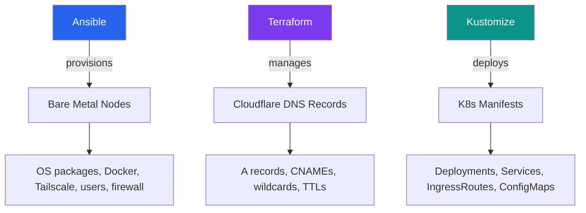

"You don't need Terraform for a homelab."

I heard that a lot when I started this project. From coworkers, from Reddit, from the voice in my head at 2 AM while writing Ansible roles for machines I could just SSH into. The argument is reasonable on its surface: it's a few servers in your office, not a fleet of EC2 instances. Just SSH in, run a few commands, move on.

I tried that. It lasted about three weeks.

## The SSH-and-hope approach

The first version of my cluster was entirely manual. SSH into each node, install Docker, configure networking, set up DNS. It worked. I had services running, dashboards loading, everything green.

Then I decided to change the CNI plugin. One bad iptables rule later, I lost connectivity to two nodes. No problem, I thought -- I'll just rebuild them. Except I couldn't remember the exact sequence of steps I'd used to provision them the first time. Was it `net.ipv4.ip_forward=1` before or after the Tailscale install? Did I configure the DNS resolver before or after joining the VPN mesh?

I rebuilt those two nodes in about six hours. Six hours of poking at config files, checking my shell history on a different machine, and reading my own Slack messages to myself from three weeks prior.

That was the last time I provisioned a node by hand.

## Three tools, three concerns

My IaC stack ended up with clear boundaries. Each tool owns exactly one layer, and they don't overlap.



**Ansible** handles node provisioning. System packages, Docker install, Tailscale enrollment, DNS resilience, user setup. It talks to bare metal (or Proxmox VMs) and makes them ready for workloads. Run it once per node, or re-run it when something drifts.

**Terraform** manages DNS exclusively. All my public DNS records for `kubelab.live` and `mlorente.dev` live in Cloudflare, and Terraform is the only thing that touches them. Service records are driven by a JSON file, so adding a new subdomain is a one-line change.

**Kustomize** handles everything inside the Kubernetes cluster. Deployments, Services, IngressRoutes, ConfigMaps, Secrets placeholders. Base manifests target staging, and a prod overlay patches domains and replicas.

## The trap nobody warns you about

Terraform's Cloudflare provider has a subtle behavior with root domain records. When you import an existing `@` record, Terraform stores it as `@`. But Cloudflare's API expects the FQDN. On the next `terraform plan`, it sees a difference between `@` and `kubelab.live` and wants to destroy and recreate the record.

The fix is simple but undocumented in most tutorials:

```hcl
resource "cloudflare_record" "kubelab_root" {
  zone_id = var.zone_id_kubelab
  name    = "kubelab.live"   # FQDN, not "@"
  content = var.vps_ip
  type    = "A"
  ttl     = 1
  proxied = true
}
```

Use the FQDN. Always. If you import with `@`, run `terraform state rm` and reimport with the full domain. Otherwise you'll force-replace your production DNS record every time you run `plan`, and you won't notice until your site goes down for the 30 seconds it takes Cloudflare to propagate the new record.

## The real argument for IaC

I've rebuilt my K3s cluster four times now. Different CNI, different node topology, different overlay network. Each rebuild, the infrastructure code was already there. Ansible provisioned the nodes in 15 minutes. Terraform applied the DNS records in seconds. Kustomize deployed all services in one `kubectl apply`.

Total rebuild time went from six hours (manual) to about 25 minutes (automated). The fourth time, I did it on a Sunday morning before coffee was ready.

That's the actual argument. Not "best practices." Not "resume-driven development." Just the cold math of how many times you'll rebuild something and how much of your weekend you want to spend doing it.

IaC for a homelab isn't overkill -- it's the only way to move fast without breaking everything permanently.
