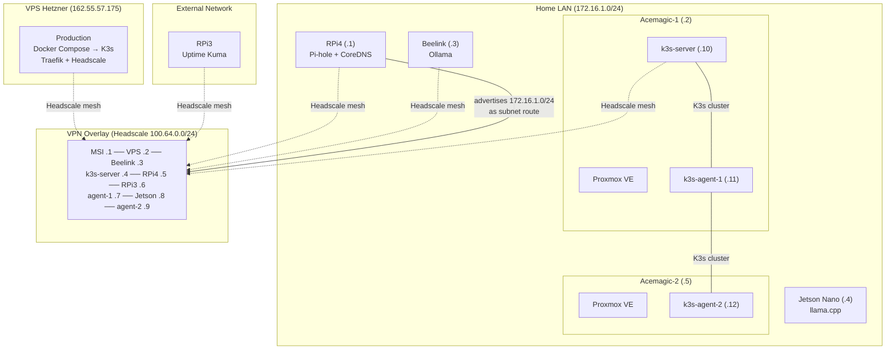

Someone asked me recently for a diagram of my homelab. I opened a blank canvas and stared at it for ten minutes. The problem wasn't that I didn't know the topology. The problem was that there are three topologies, layered on top of each other, and drawing one without the other two is misleading.

There's the physical LAN. There's the VPN overlay. And there's the DNS layer that decides which path a request actually takes. None of them work in isolation. Together, they turn 9 scattered nodes into something that behaves like a single environment.

## The physical layer

My LAN is a flat /24 at 172.16.1.0. Every bare-metal node has a static IP:

| Node | IP | Role |
|------|-----|------|
| RPi4 (8GB) | .1 | DNS gateway (Pi-hole + CoreDNS) |
| Acemagic-1 (12GB) | .2 | Proxmox host (k3s-server + agent-1 VMs) |
| Beelink (8GB) | .3 | Ollama bare metal (LLM inference) |
| Jetson Nano (4GB) | .4 | Edge inference (llama.cpp) |
| Acemagic-2 (12GB) | .5 | Proxmox host (k3s-agent-2 VM) |

Then the VMs running on Proxmox:

| VM | IP | Host |
|-----|-----|------|
| k3s-server | .10 | Acemagic-1 |
| k3s-agent-1 | .11 | Acemagic-1 |
| k3s-agent-2 | .12 | Acemagic-2 |

The RPi3 (1GB) sits on a separate network entirely. It runs Uptime Kuma for external monitoring -- you don't put your monitoring on the same network as the thing you're monitoring.

And then there's the VPS. A Hetzner CX22 at 162.55.57.175. That's production. Docker Compose today, K3s eventually. It's not on my LAN. It's not even in the same country.

Two things to notice. First, the K3s cluster spans two physical hosts but it's three VMs -- the control plane and one agent share Acemagic-1, the heavy worker gets all of Acemagic-2. Second, the VPN overlay connects everything, including nodes that can't see each other on the LAN.

## The VPN is the backbone

Headscale (self-hosted Tailscale control plane) runs on the VPS at `vpn.kubelab.live`. Every node runs a Tailscale client that connects to it. This creates a WireGuard mesh where any node can reach any other node, regardless of NATs, firewalls, or physical location.

The RPi4 does something critical: it advertises the entire 172.16.1.0/24 subnet as a Headscale route. This means my MSI workstation (which is only on the VPN, not on the LAN) can SSH directly into 172.16.1.10 (k3s-server) through the RPi4's subnet route. Without this, VPN clients could only reach nodes that have Tailscale installed -- not the Proxmox VMs behind them.

There's a bootstrap dependency that took me a while to internalize. Headscale runs on the VPS. Tailscale clients need to reach the VPS to join the mesh. If DNS resolves `vpn.kubelab.live` through the VPN... you have a circular dependency. The VPN needs DNS, DNS needs the VPN.

The rule is absolute: `vpn.kubelab.live` must always resolve to the public IP `162.55.57.175`, never to the Tailscale IP `100.64.0.2`. Every node has a static `/etc/hosts` entry for this. An Ansible role called `dns_resilience` manages it across all 7 nodes. If the RPi4 goes down and takes DNS with it, Tailscale can still reconnect because it never depended on DNS for the control plane in the first place.

## Three ingress paths

This is where people's eyes glaze over, but it's the core of the whole design. There are three completely separate paths a request can take, depending on which domain you're hitting.

```mermaid
flowchart TB
    subgraph "1. Production"
        U1["User"] -->|"*.kubelab.live"| CF["Cloudflare DNS"]
        CF -->|"162.55.57.175"| VPS_T["VPS Traefik\n(Docker)"]
        VPS_T --> APP1["App containers"]
    end

    subgraph "2. Staging (VPN only)"
        U2["Developer\n(on VPN)"] -->|"*.staging.kubelab.live"| HS["Headscale\nsplit DNS"]
        HS -->|"100.64.0.5"| PH["RPi4 Pi-hole\n:53"]
        PH -->|"conditional\nforward"| CD["CoreDNS\n:5353"]
        CD -->|"100.64.0.4"| K3S_T["K3s Traefik\nIngress"]
        K3S_T --> APP2["K3s pods"]
    end

    subgraph "3. Development"
        U3["Developer\n(localhost)"] -->|"*.kubelab.test"| ETC["/etc/hosts\n127.0.0.1"]
        ETC --> LOCAL["Local dev\nserver"]
    end
```

**Production** is public. `*.kubelab.live` goes through Cloudflare, hits the VPS at its public IP, and Traefik routes it to the right container. Standard setup, nothing unusual.

**Staging** is VPN-only. This is the interesting one. Headscale has split DNS configured for the `staging.kubelab.live` subdomain. When a VPN client queries `grafana.staging.kubelab.live`, Headscale intercepts the DNS query and sends it to the RPi4's Tailscale IP (100.64.0.5) instead of a public resolver. Pi-hole receives it, matches the `kubelab.live` zone, and forwards it to CoreDNS on port 5353. CoreDNS knows that `*.staging.kubelab.live` resolves to 100.64.0.4 -- the k3s-server's Tailscale IP, where Traefik is listening.

The split DNS only targets `staging.kubelab.live`, not the broader `kubelab.live`. I learned this the hard way. When I initially configured it for all of `kubelab.live`, production domains also routed through the RPi4. If the RPi4 went down, prod domains became unreachable from VPN clients -- even though they have perfectly valid public Cloudflare records. Narrowing the split to `staging.kubelab.live` means production always resolves through public DNS, regardless of the RPi4's health.

**Dev** is trivial. `/etc/hosts` maps `*.kubelab.test` to localhost. No DNS infrastructure involved.

## External services: not everything runs on K3s

The Beelink runs Ollama bare metal. It's not a Kubernetes pod. The RPi3 runs Uptime Kuma. Also not a pod. But I still want to access them through K3s Traefik with proper TLS and authentication.

The pattern is a headless Service plus an EndpointSlice that points at the node's real IP. Kubernetes thinks it's routing to a pod. It's actually routing to a bare-metal process on a different machine. The manifests live in `infra/k8s/base/external/` and carry the label `kubelab.live/location: external` so I can identify them at a glance.

It's a clean abstraction. Every service in the cluster has the same ingress pattern -- IngressRoute, TLS, middleware -- regardless of whether it's a pod on K3s or a process on a Beelink.

## SSH and access patterns

Day to day, I SSH into nodes using their Headscale IPs. `ssh 100.64.0.4` hits the k3s-server from anywhere, whether I'm at home or in a coffee shop. The VPN handles the routing.

For the Proxmox VMs, there's a ProxyJump through the Proxmox host. The VMs don't have Tailscale installed (they don't need it -- the RPi4's subnet route covers them), so reaching them from outside the LAN means hopping through a node that is on both networks.

LAN IPs are the fallback. If Headscale is down, I can still reach everything from the local network. This has saved me twice -- once when I accidentally broke Tailscale on the RPi4 while updating its config, and once during a Headscale upgrade that took longer than expected.

## Security boundaries

Headscale supports ACLs with user-based groups. I have three:

- **kubelab**: Full admin access to everything. My personal devices.
- **work**: Windows PCs. Isolated. Can reach the VPN but nothing else on the mesh. Implicit deny.
- **contractors**: Not used yet, but the group exists. When I eventually give someone access to a specific service, they'll get a scoped ACL that only reaches that service's Tailscale IP.

No outbound rules on work devices. They can reach the internet through their own gateway, but they can't reach a single node on my homelab. The VPN is not a flat network.

## What I've learned

The VPN mesh is not a nice-to-have. Without Headscale, my homelab is five boxes in a closet and a VPS in Germany with no relationship between them. The mesh is what turns physical hardware into an environment.

DNS is the single point of failure. The RPi4 going down cascades into everything. The resilience patterns -- `/etc/hosts` fallbacks, dual nameservers (`127.0.0.1` + `8.8.8.8` on the RPi4 itself), Ansible-managed static entries -- aren't paranoia. They're the difference between "the RPi4 is down" and "the entire homelab is down."

Every node has one job. The RPi4 is the gateway. The Beelink runs LLMs. The VPS runs prod. The Acemagics run K3s VMs. When I tried to also run a container registry on the RPi4, debugging became impossible because a DNS issue and a registry issue looked identical. I moved it to K3s and the RPi4 went back to doing one thing well.

The topology looks complex on a diagram. In practice, each layer has a clear purpose: physical gives you wires, VPN gives you reach, DNS gives you names. If you understand which layer is responsible for what, debugging becomes a matter of asking "which layer is broken?" instead of staring at `tcpdump` output for an hour.

Nine nodes, two networks, three DNS paths. It's not simple. But every piece is there for a reason, and I can explain every one of them. That's the point.
