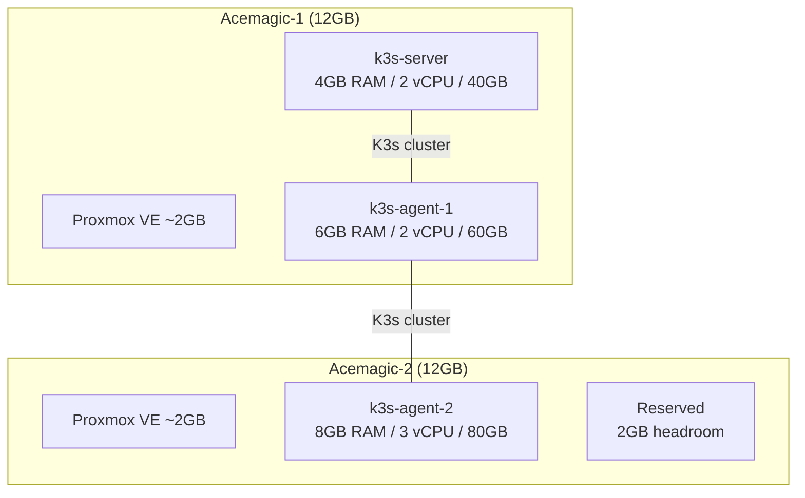

The Proxmox installer ran without a hitch. Boot from USB, click through the wizard, reboot. Fifteen minutes. I was feeling optimistic.

That feeling lasted about an hour.

## Why Proxmox

Before the war stories, the quick rationale. I evaluated three options:

- **VMware ESXi**: The free tier is gone. Broadcom killed it. Even if it still existed, running proprietary hypervisors on a homelab contradicts the entire point of learning infrastructure from the ground up.
- **Bare metal K3s**: No hypervisor, just install K3s directly on the mini PCs. Simpler, but you lose the ability to snapshot, clone, or rebuild VMs without reimaging the entire machine. One bad upgrade and you're reinstalling the OS.
- **Proxmox VE**: Free, KVM-based, production-grade, web UI for when SSH gets tedious. Supports ZFS, cloud-init, live migration (if I ever add shared storage). The clear winner.

Proxmox also gives me something important for learning: isolation. I can run multiple VMs on the same physical node and treat them as separate machines. One Acemagic can host both a K3s server and a K3s agent without them sharing an OS or a filesystem.

## The BIOS dance

Both Acemagic mini PCs use an AMI Aptio BIOS. The first thing I needed to configure was auto-power-on — these machines run headless in a closet, and if the power blinks, they need to come back up without someone pressing the button.

The setting is buried under `Advanced > ACPI Settings > State after G3`. Set it to `S0 State` (power on). Not labeled clearly, not in the obvious place, not in the manual. Every mini PC BIOS is slightly different, and none of them make this easy.

Virtualization (VT-x) was already enabled on the Acemagics. On cheaper mini PCs, it sometimes isn't. Check before you buy — Proxmox won't run KVM without it.

## VM planning

With 12GB per Acemagic and Proxmox itself needing about 1-2GB of overhead, here's how I divided it:



The server node gets less RAM (4GB) because it only runs the control plane and lightweight workloads. Agent-2 on the second Acemagic gets the most (8GB) because that's where I schedule heavy things — Loki, Grafana, anything with a real memory appetite.

I kept 2GB free on Acemagic-2 as headroom. Proxmox overcommit is possible but dangerous with Kubernetes — the OOM killer doesn't care about your pod priority classes when the host itself is out of memory.

## Creating the VMs

Proxmox supports cloud-init, so I used Ubuntu Server cloud images instead of running the installer manually for each VM. Download the image once, create a template, clone it.

```bash
# On Proxmox host — create a VM template from Ubuntu cloud image
qm create 9000 --name ubuntu-template --memory 2048 --net0 virtio,bridge=vmbr0
qm importdisk 9000 ubuntu-24.04-server-cloudimg-amd64.img local-lvm
qm set 9000 --scsihw virtio-scsi-pci --scsi0 local-lvm:vm-9000-disk-0
qm set 9000 --ide2 local-lvm:cloudinit
qm set 9000 --boot c --bootdisk scsi0
qm set 9000 --serial0 socket --vga serial0
qm template 9000

# Clone for each node
qm clone 9000 101 --name k3s-server --full
qm set 101 --memory 4096 --cores 2
qm set 101 --ipconfig0 ip=172.16.1.10/24,gw=172.16.1.1
qm set 101 --ciuser manu --sshkeys /root/.ssh/authorized_keys.pub

qm clone 9000 102 --name k3s-agent-1 --full
qm set 102 --memory 6144 --cores 2
qm set 102 --ipconfig0 ip=172.16.1.11/24,gw=172.16.1.1
```

Three VMs from one template, each with a static IP, SSH keys baked in, ready to boot. No clicking through Ubuntu installers.

## The hostname trap

Everything was running. Three VMs across two Proxmox hosts, all reachable via SSH, all with the right IPs. Then I decided to rename one of the Proxmox hosts.

I changed the hostname in `/etc/hostname` and `/etc/hosts`, rebooted. Proxmox came up fine. The web UI loaded. But my VMs were gone.

Not deleted — gone from the UI. The VM disks were still there on the storage. The config files were still there too, just in the wrong place.

Proxmox stores VM configuration under `/etc/pve/nodes/{hostname}/qemu-server/`. When I changed the hostname from `pve` to `acemagic-1`, Proxmox created a new directory at `/etc/pve/nodes/acemagic-1/` and left the VM configs orphaned under `/etc/pve/nodes/pve/`.

The fix was moving the config files:

```bash
mv /etc/pve/nodes/pve/qemu-server/* /etc/pve/nodes/acemagic-1/qemu-server/
```

Not destructive, but alarming if you don't know where to look. Set your hostname before creating VMs. Not after.

## OS consistency: pick one and stick with it

I briefly considered running Arch on the K3s VMs because I use it on my workstation and know the package manager well. Then I thought about what happens when I need to match the production environment.

Production runs on a Hetzner VPS with Ubuntu. If staging runs Arch (rolling release, bleeding edge kernels, different libc behavior) and prod runs Ubuntu LTS (frozen packages, older kernel), I'm going to hit bugs in staging that don't exist in prod and miss bugs in prod that don't show up in staging. That defeats the purpose of having a staging environment.

Ubuntu Server 24.04 LTS everywhere. Same OS, same kernel lineage, same package versions. The staging cluster should be a miniature replica of production, not a different animal.

## First impressions

Proxmox is solid. The web UI is better than it has any right to be for a free product. VM creation is fast, cloud-init support works well, and the API is comprehensive enough that I could automate everything with Ansible later.

The learning curve is in the details — BIOS settings, hostname gotchas, resource planning with constrained RAM. None of it is hard. All of it is time-consuming when you hit it unprepared.

The real test comes next: installing K3s across these VMs and getting a functional cluster. That's where the "just follow the quickstart" advice falls apart and the actual infrastructure work begins.
