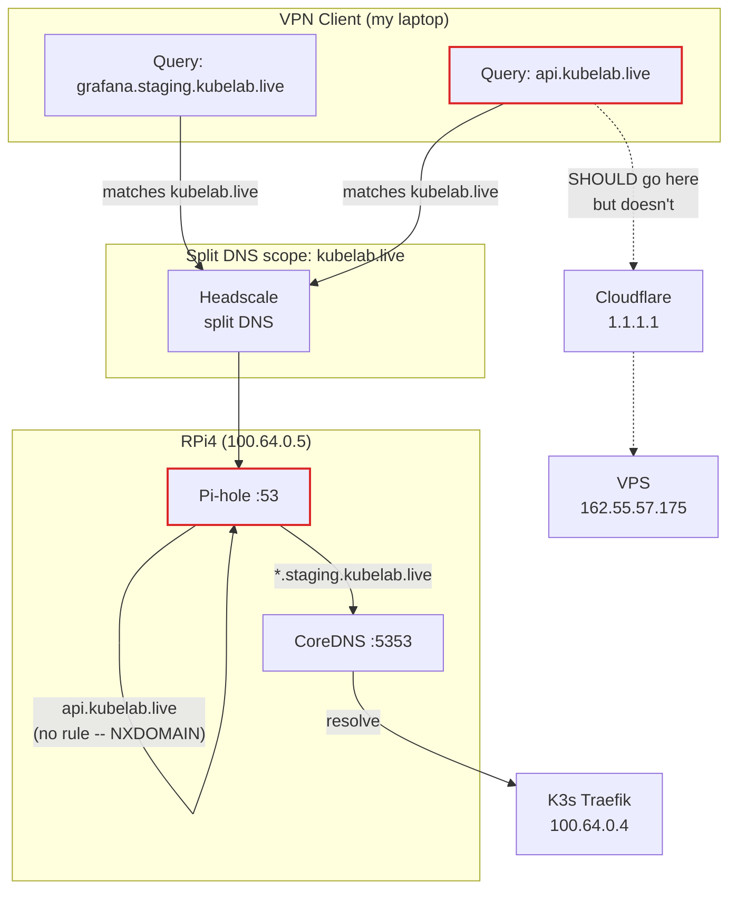
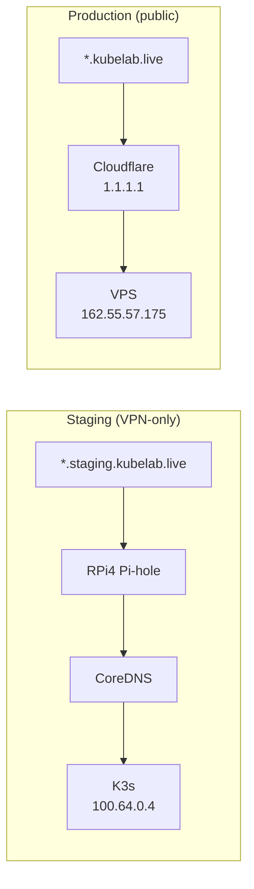

I took down my own production domains from my own laptop. Not with a bad deploy. Not with a misconfigured firewall. With a single DNS setting that was too broad by one subdomain level.

## The setup

My homelab runs a 3-layer DNS stack. Headscale provides split DNS to VPN clients. Those queries land on a Raspberry Pi 4 running Pi-hole on port 53, which forwards `*.staging.kubelab.live` to CoreDNS on port 5353. CoreDNS resolves those names to 100.64.0.4, the K3s Traefik ingress on the Headscale mesh.

Production domains -- `status.kubelab.live`, `api.kubelab.live`, the things actual users hit -- live in Cloudflare. Public DNS. They resolve to 162.55.57.175, my Hetzner VPS. No VPN involved.

This worked perfectly until I configured Headscale's split DNS.

## The mistake

Headscale has a `dns.nameservers.split` configuration that tells Tailscale clients: "For queries matching this domain, use these nameservers instead of your default resolver." I set it to `kubelab.live`, pointing at the RPi4's Pi-hole.

```yaml
dns:
  nameservers:
    global:
      - 1.1.1.1
    split:
      kubelab.live:
        - 100.64.0.5  # RPi4 Pi-hole
```

The intent was clear: route staging queries through the VPN so I can reach `grafana.staging.kubelab.live` from my workstation. And it worked. Staging was reachable. I closed the terminal and moved on.

Two days later I noticed my uptime monitor was green but I couldn't reach `status.kubelab.live` from my laptop. Couldn't reach `api.kubelab.live` either. The browser just hung. From my phone (not on the VPN), everything loaded fine.

## The debugging

The split DNS scope was `kubelab.live`. That matches everything: `staging.kubelab.live`, yes, but also `status.kubelab.live`, `api.kubelab.live`, `vpn.kubelab.live` -- every single subdomain. All those queries from my VPN-connected laptop were going to the RPi4 instead of Cloudflare.

```bash
# From my workstation (on VPN)
$ dig api.kubelab.live
;; SERVER: 100.64.0.5#53
;; ANSWER SECTION:
;; (empty -- RPi4 doesn't know about prod domains)

# From my phone (not on VPN)
$ dig api.kubelab.live
;; SERVER: 1.1.1.1#53
;; ANSWER SECTION:
api.kubelab.live.    300    IN    A    162.55.57.175
```

Pi-hole on the RPi4 only has forwarding rules for `*.staging.kubelab.live`. It doesn't know what `api.kubelab.live` should resolve to, so it returns nothing. Or worse -- if the RPi4 is rebooting, or Pi-hole is restarting, or Docker is having a moment, the query times out entirely.

Here's what was happening:



The red path is the problem. `api.kubelab.live` matches the `kubelab.live` split DNS scope, gets routed to the RPi4, and the RPi4 has no idea what to do with it. The query never reaches Cloudflare, where the real A record lives.

And here's the worst part: this turned the RPi4 into a single point of failure for ALL my domains, including production. A Raspberry Pi sitting on a shelf behind my router, running off a USB power supply, was now the gatekeeper for whether I could reach my VPS from my own workstation.

## The fix

Narrow the split DNS scope from `kubelab.live` to `staging.kubelab.live`:

```yaml
dns:
  nameservers:
    global:
      - 1.1.1.1
    split:
      staging.kubelab.live:
        - 100.64.0.5  # RPi4 Pi-hole
```

One line changed. Now only `*.staging.kubelab.live` queries go to the RPi4. Everything else -- including all production domains -- resolves through public DNS (1.1.1.1) regardless of whether the RPi4 is up, down, or on fire.

For VPN-only bare-metal services that don't live under `staging.kubelab.live` (like Ollama on the Beelink or the Jetson Nano), I use Headscale's `extra_records` instead of split DNS:

```yaml
dns:
  extra_records:
    - name: ollama.kubelab.live
      type: A
      value: 100.64.0.3
    - name: jetson.kubelab.live
      type: A
      value: 100.64.0.8
```

These are static DNS records served directly by Headscale to VPN clients. No Pi-hole in the loop. No single point of failure beyond Headscale itself.

## The resolution paths now

After the fix, DNS resolution follows two clean, independent paths:



Staging goes through the VPN. Production goes through public DNS. They don't interfere with each other. If the RPi4 dies, I lose staging access. I don't lose production.

## The lesson

Split DNS scope should be as narrow as possible. Not "the domain I want to reach" but "the exact subdomain subtree I need to intercept." The difference between `kubelab.live` and `staging.kubelab.live` is one label in a config file and the difference between a functioning production environment and one that depends on a Raspberry Pi staying plugged in.

Broad split DNS creates invisible single points of failure. The failure mode is especially nasty because it only affects VPN clients. Your monitoring (probably not on the VPN) sees everything as healthy. Your users (probably not on the VPN) have no issues. You, sitting at your desk, connected to your own VPN, are the only person who can't reach your own services. And the first thing you'll suspect is the service itself, not the DNS path.

When something doesn't resolve, check where the query is going before you check what's answering it. `dig` with an explicit `@resolver` is the fastest way to figure out if your query is even reaching the right nameserver. Half the time, it's not.
